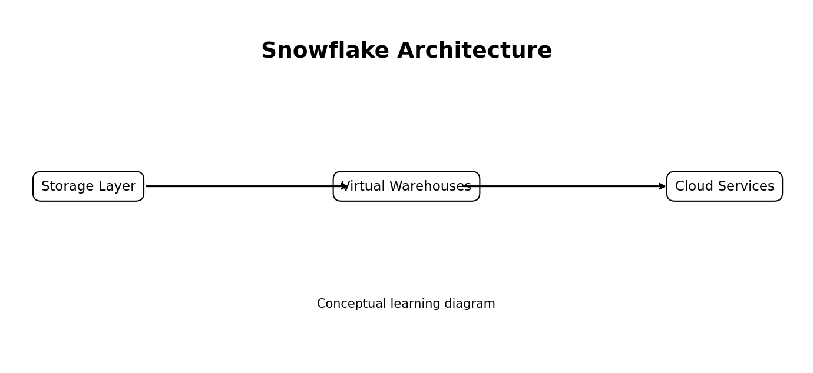

# 2. Snowflake Architecture

## Introduction

Snowflake uses a multi-cluster shared data architecture with three major
layers: database storage, query processing through virtual warehouses,
and cloud services for authentication, metadata, optimization, and
transaction management.

## Learning Objectives

By the end of this topic, learners should understand the main concepts,
explain where the feature fits in Snowflake architecture, identify
common use cases, and apply the topic in a practical Snowflake
environment.

## Key Concepts

-   **Storage layer:** Understand the purpose, behavior, and practical
    importance of this concept.
-   **Compute layer:** Understand the purpose, behavior, and practical
    importance of this concept.
-   **Cloud services layer:** Understand the purpose, behavior, and
    practical importance of this concept.
-   **Metadata-driven optimization:** Understand the purpose, behavior,
    and practical importance of this concept.
-   **Independent workload isolation:** Understand the purpose,
    behavior, and practical importance of this concept.

## How It Works

The conceptual flow for this module is:

**Storage Layer → Virtual Warehouses → Cloud Services**

The exact implementation depends on workload type, security model,
performance requirements, latency expectations, and cost controls.
During the practical session, learners should connect the concept to SQL
objects and Snowflake monitoring features.

## Practical Session

1.  Review the feature in Snowsight.
2.  Create or configure the required Snowflake objects.
3.  Execute a small working example.
4.  Validate the output using SQL.
5.  Review performance, security, and cost considerations.
6.  Discuss one real-world data engineering use case.

## Best Practices

-   Use clear naming conventions for Snowflake objects.
-   Apply least-privilege access through roles.
-   Monitor query behavior and credit usage.
-   Separate development, testing, and production workflows.
-   Validate data quality after each transformation step.
-   Document dependencies and operational ownership.

## Discussion Questions

-   What business problem does this feature solve?
-   When should this feature be used?
-   What are the performance implications?
-   What are the cost implications?
-   How does the feature integrate with an end-to-end data pipeline?

## Summary

Snowflake Architecture is an important part of a complete Snowflake
learning path. Understanding both the concept and the hands-on workflow
helps learners design scalable, secure, maintainable, and cost-aware
data solutions.
